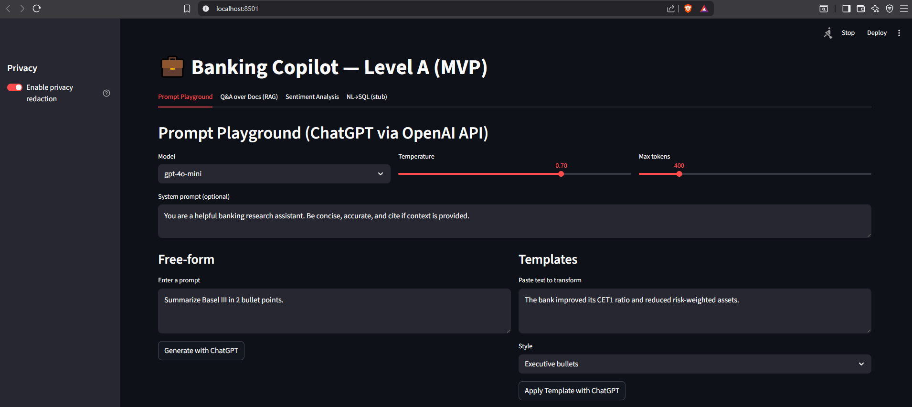
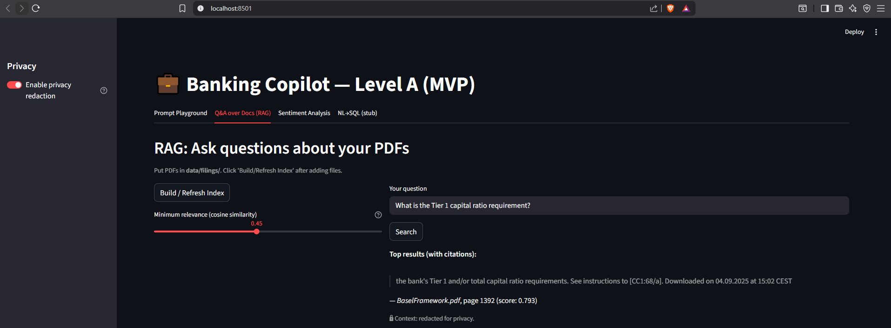
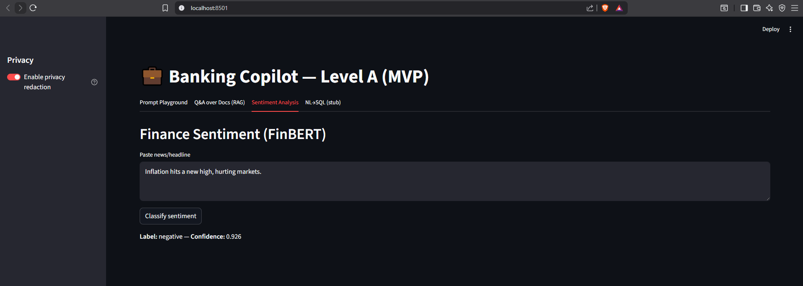
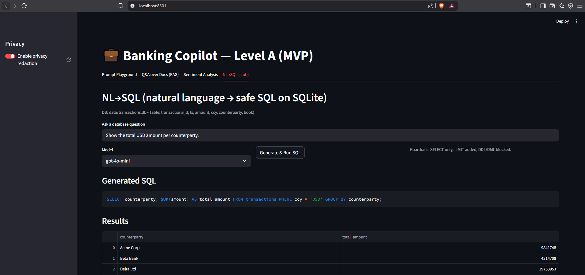

# 💼 Banking Copilot – Level A (MVP)

A Streamlit-based demo app that showcases **Large Language Model (LLM)** techniques for **banking and finance**.  
Built as an **interview-ready MVP**, it demonstrates prompt engineering, RAG document Q&A, sentiment analysis, and an NL→SQL prototype.

---

## ✨ Features

### 1) Prompt Playground (OpenAI API)
- Free-form prompts powered by **ChatGPT (gpt-4o-mini / gpt-4o)**.
- Preset styles to illustrate **prompt engineering**:
  - Executive bullet summary
  - Explain like I’m five
  - Risks only

### 2) Q&A over Documents (RAG)
- Place PDFs (e.g., Basel III summaries, 10-K risk factors) in `data/filings/`.
- Text is chunked, embedded with `sentence-transformers/all-MiniLM-L6-v2`, and retrieved via **cosine similarity**.
- Returns **cited snippets** (filename + page).

### 3) Financial Sentiment Analysis
- Classify headlines/news using **FinBERT (ProsusAI/finbert)**.
- Labels: **Positive / Negative / Neutral** with confidence.

### 4) NL→SQL (Prototype)
- Natural language → sample SQL translation (static demo for Level A).
- Roadmap includes schema-aware dynamic SQL (Level B).

---

## 🔒 Privacy by Design
- Lightweight regex-based **PII redaction** (emails, long digit sequences, phone numbers).
- Toggle on/off in the sidebar.
- Clear extension point for enterprise-grade PII detection later.

---

## 🛠️ Tech Stack

- **Python 3.11+**
- Streamlit – rapid UI
- OpenAI API – GPT models (prompt engineering)
- Hugging Face Transformers – FinBERT sentiment
- Sentence-Transformers – MiniLM embeddings (RAG)
- PyMuPDF – PDF parsing
- SQLite (toy DB for NL→SQL)

---

## 🚀 Getting Started

### 1) Clone the repo
```bash
git clone https://github.com/<your-username>/banking-copilot-mvp.git
cd banking-copilot-mvp 
```

### 2) Set up a virtual environment
```bash
python -m venv .venv

# Windows:
.venv\Scripts\activate

# macOS/Linux:
source .venv/bin/activate
```
### 3) Install dependencies
```bash
pip install -r requirements.txt
```
### 4) Configure the OpenAI API key
Edit Config.py

### 5) Run the Streamlit app
```bash
streamlit run app.py
```
## 📂 Project Structure
```bash 
banking-copilot-mvp/
│── app.py                 # Main Streamlit app
│── requirements.txt       # Dependencies
│── README.md              # This file
│── utils/
│    ├── privacy.py        # Regex-based PII redaction
│    ├── sentiment.py      # FinBERT / zero-shot sentiment
│    ├── rag_ingest.py     # PDF → chunks → embeddings
│    └── rag_retriever.py  # Semantic search over chunks
│── data/                  # Place 10-K PDFs here
│── .env                   # Your API key (not committed)
```
## 📊 Features
✅ Prompt playground (ChatGPT via OpenAI API)  
✅ Privacy filtering (emails, phone numbers, accounts)  
✅ Sentiment analysis on financial text (FinBERT + zero-shot)  
✅ RAG-style search over filings (cosine similarity, top-k)

## 📸 Screenshots

### Prompt Playground


### RAG Q&A


### Sentiment Analysis


### NL→SQL



## ⚖️ Disclaimer

This is a demo project. **Not for production or financial decision-making.**  
Always verify outputs independently.
